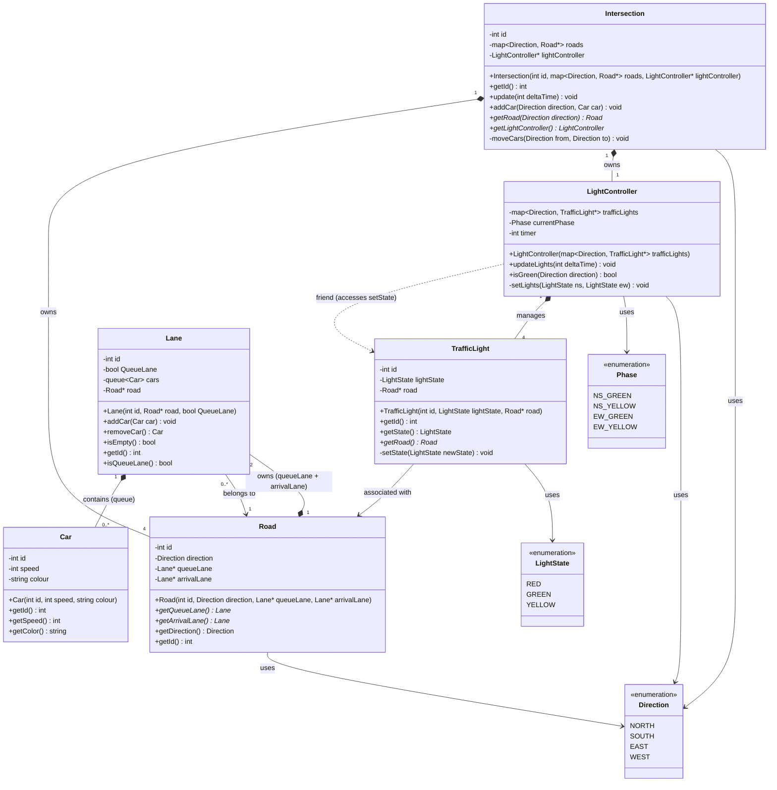

# Traffic Management System — UML Class Diagram

## Notes

- **Friendship**: `LightController` is declared a `friend` of `TrafficLight`, giving it exclusive access to the private `setState()` method (shown as a dashed dependency).
- **Containment hierarchy**: `Intersection` → `Road` → `Lane` → `Car`
- **Traffic flow**: On each `update()` tick, `Intersection` checks the green directions via `LightController` and moves one car from a road's `queueLane` to the opposite road's `arrivalLane`.
- **Phase cycle**: `NS_GREEN` → `NS_YELLOW` → `EW_GREEN` → `EW_YELLOW` → repeat, governed by `GREEN_DURATION=10`, `YELLOW_DURATION=3`, `RED_DURATION=10`.
